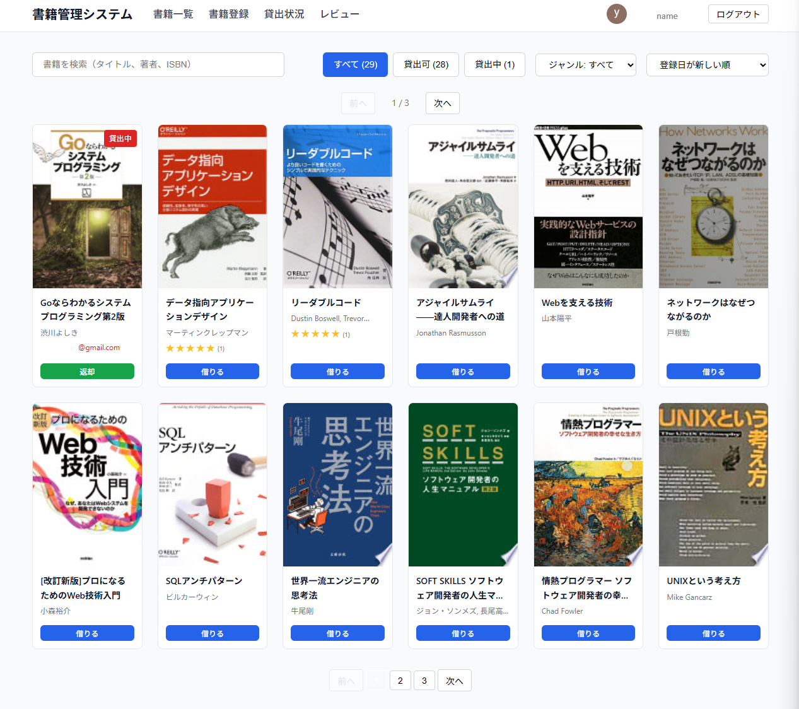

# 書籍管理システム

組織向けの書籍貸出管理システムです。Google認証で特定ドメインのユーザーのみがアクセスでき、書籍の登録・検索・貸出管理が行えます。



## 機能

- **書籍一覧**: 登録済み書籍の閲覧・検索・ジャンルフィルター・ソート
  （登録日順・レビュー件数順・レビュー評価順）
- **書籍登録**: タイトル/ISBN検索によるGoogle Books API自動取得、または手動入力（admin のみ）
- **一括登録**: タイトル・ISBNの一覧から一括登録（admin のみ）
  - 確認画面でタイトル不一致の警告・登録済み重複チェック付き
- **貸出管理**: 借りた人・貸出日・返却日を記録
- **レビュー**: 書籍への星評価（5段階）・コメント投稿・レビュー一覧

## コスト

すべてのサービスを無料枠内で運用できます。社内利用規模であれば **月額0円** です。

| サービス | 無料枠 | 備考 |
|----------|--------|------|
| AWS Lambda | 月100万リクエスト | 社内利用では到達しない |
| Amazon S3 | 5GB | 静的ファイルのみ、数MB程度 |
| Amazon CloudFront | 月1TB転送 | |
| Google Sheets API | 月60,000リクエスト | DBとして使用 |
| Google Books API | 1日1,000リクエスト | 書籍登録時のみ使用 |
| Google OAuth | 無料 | |
| GCP Workload Identity Federation | 無料 | |

RDSやDynamoDB等の有料DBを使わず、Google スプレッドシートをデータベースとして活用することで、
固定費ゼロで運用できます。

## セキュリティ

認証・認可・通信のすべてのレイヤーで保護されています。

### 認証・認可

- **Google OAuth 認証**: ドメイン制限で組織外のアクセスを遮断
- **ロールベース認可**: admin / user の2段階権限（書籍登録・削除は admin のみ）
- **ID Token 検証**: Lambda側でGoogle ID Tokenの署名・有効期限・audienceを検証

### インフラ

- **CloudFront OAC**: S3・Lambda Function URL への直接アクセスを遮断し、
  CloudFront経由のみに制限
- **Lambda Function URL (AWS_IAM認証)**: IAM認証必須のため、
  URL単体ではアクセス不可
- **CORS制御**: 許可オリジンを制限

### 秘密情報の管理

- **Workload Identity Federation**: GCPサービスアカウントの鍵ファイルが不要。
  AWS IAMロールでGCPを認証するため、鍵の漏洩リスクがない
- **APIキーのサーバーサイド管理**: Google Books APIの呼び出しはLambda経由。
  フロントエンドにAPIキーが露出しない
- **環境変数による設定**: ソースコードにシークレットをハードコーディングしない

## 技術構成

| 層 | 本番 | 開発 |
|----|------|------|
| フロントエンド | React + TypeScript (S3+CloudFront) | React + TypeScript (Vite) |
| バックエンド | AWS Lambda (Function URL + CloudFront OAC) | 同左（SAM CLI） |
| データベース | Google スプレッドシート | 同左（開発用シート） |
| 認証 | Google Identity Services | 同左 |
| GCP認証 | Workload Identity Federation | 同左 |

## ディレクトリ構造

```
library/
├── frontend/           # React フロントエンド
│   ├── src/
│   │   ├── components/ # 共通コンポーネント
│   │   ├── pages/      # ページコンポーネント
│   │   ├── services/   # API クライアント
│   │   ├── contexts/   # React Context
│   │   └── types/      # 型定義
│   └── public/
│       └── images/     # 開発用画像
├── lambda/             # Lambda バックエンド
│   ├── src/
│   └── template.yaml   # SAM テンプレート
├── scripts/            # デプロイスクリプト
└── README.md
```

## セットアップ

### 前提条件

- Node.js 24+
- npm
- AWS CLI（設定済み）
- AWS SAM CLI
- Google Cloud SDK（gcloud CLI）
- Googleアカウント

### 1. Google Cloud Console の設定

1. [Google Cloud Console](https://console.cloud.google.com/) で新規プロジェクトを作成
2. 「APIとサービス」→「ライブラリ」で以下を有効化:
   - Google Sheets API
   - Google Books API
   - IAM Service Account Credentials API
3. 「APIとサービス」→「認証情報」→「認証情報を作成」→「OAuthクライアントID」
   - アプリケーションの種類: ウェブアプリケーション
   - 承認済みJavaScript生成元:
     - `http://localhost:5173`（開発用）
     - `https://your-domain.com`（本番用）
   - 承認済みリダイレクトURI: 空でOK（ポップアップモードのため不要）
4. クライアントIDをメモ
5. サービスアカウントを作成（鍵の作成は不要）

### 2. Google スプレッドシートの準備

1. 新規スプレッドシートを作成
2. URLからスプレッドシートIDをコピー（`/d/` と `/edit` の間の文字列）
3. サービスアカウントのメールアドレスに「編集者」権限で共有
4. 以下のシートを作成し、1行目にヘッダーを設定:

**booksシート:**
```
id,title,isbn,authors,publisher,publishedDate,imageUrl,googleBooksId,createdAt,createdBy,genre,titleKana
```

**loansシート:**
```
id,bookId,borrower,borrowedAt,returnedAt
```

**reviewsシート:**
```
id,bookId,rating,comment,createdBy,createdAt,updatedAt
```

**usersシート:**
```
email,role,createdAt
```
- `role`: `admin` または `user`
- 管理者のみ登録すればOK（未登録ユーザーは `user` として扱われる）

### 3. Workload Identity Federation の設定

サービスアカウントキーの代わりに、AWS IAM ロールで GCP を認証します。
鍵ファイルの管理が不要になりセキュリティが向上します。

詳細は [lambda/README.md](./lambda/README.md) の「Workload Identity Federation の設定」を参照。

### 4. Lambda バックエンドのセットアップ

詳細は [lambda/README.md](./lambda/README.md) を参照。

```bash
cd lambda
npm install
npm run build
sam deploy --guided
```

デプロイ時に以下のパラメータを設定:

| パラメータ | 説明 |
|-----------|------|
| `SpreadsheetId` | Google スプレッドシートのID |
| `GcpProjectNumber` | GCPプロジェクト番号 |
| `GcpWifPoolId` | Workload Identity Pool ID |
| `GcpWifProviderId` | Workload Identity Provider ID |
| `GcpServiceAccountEmail` | GCPサービスアカウントのメールアドレス |
| `GoogleClientId` | Google OAuthクライアントID |
| `AllowedDomains` | 許可ドメイン（カンマ区切り、空で全許可） |

### 5. フロントエンドのセットアップ

```bash
cd frontend
npm install

# 環境変数を設定
cp .env.example .env.development
```

`.env.development` を編集:

```
VITE_GOOGLE_CLIENT_ID=<OAuthクライアントID>
VITE_API_URL=<CloudFront経由のAPI URL>
VITE_ALLOWED_DOMAINS=              # 空欄で全ドメイン許可
```

### 6. 開発サーバーの起動

```bash
cd frontend
npm run dev
```

http://localhost:5173 でアクセスできます。

## 本番デプロイ

### デプロイスクリプト

```bash
# Lambda バックエンド（ビルド＆デプロイ）
./scripts/deploy-backend.sh

# フロントエンド（ビルド＆S3アップロード＆CloudFrontキャッシュ無効化）
./scripts/deploy-frontend.sh <S3バケット名> <CloudFront Distribution ID> [S3プレフィックス]
```

フロントエンドのデプロイでは以下のキャッシュ制御が自動適用されます:
- ハッシュ付きアセット（JS/CSS等）: 1年間の immutable キャッシュ
- `index.html`: キャッシュなし（常に最新を取得）

### 初回デプロイ時

```bash
# フロントエンド本番用環境変数を設定
cd frontend
cp .env.example .env.production
# .env.production を編集
```

## 権限マトリックス

| 操作 | user | admin |
|------|------|-------|
| 書籍閲覧・検索 | o | o |
| 書籍登録 | x | o |
| 書籍削除 | x | o |
| 貸出（借りる） | o | o |
| 返却 | 自分のみ | 全員分 |
| レビュー投稿・編集 | o | o |
| レビュー削除 | 自分のみ | 全員分 |

未登録ユーザーは `user` として扱われます。

## 開発時の注意点

### Google Books API

- Lambda経由で呼び出し（フロントエンドからは直接アクセスしない）
- Workload Identity Federation で認証済みのリクエストを使用
- 書籍登録・一括登録で利用

### 画像の扱い

- 現在はGoogle Books APIのURLをそのまま使用
- 本番で大規模利用する場合はS3への保存を検討

## ライセンス

MIT
